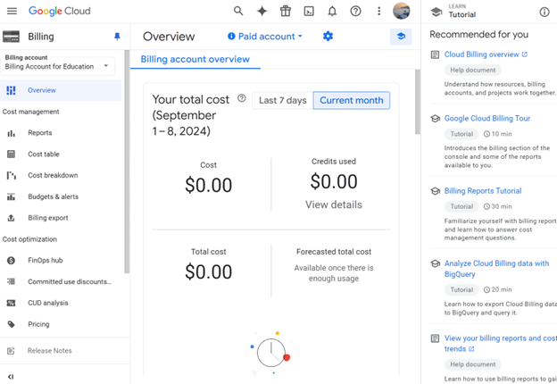

## Exploring Cost Management and Billing on Azure and GCP
### Azure Cost Management and Billing

#### Azure Cost Management Overview
Overview of the Azure Cost Management dashboard, showing the tools available for tracking and managing cloud costs:

#### Azure Dashboard
Here is the main Azure dashboard where cost management tools are accessed:

#### Azure Budget Setup
This screenshot is the budget I set up in Azure, with a monthly spend of $8 and a notification threshold set at 80%:

#### Azure Advisor Page
The Azure Advisor page provides cost-saving recommendations based on current usage:

### GCP Billing Overview

#### Google Workspace Account Disabled
This shows the error message encountered when trying to access GCP initially due to a disabled Google Workspace account:

#### Google Cloud Billing Account Overview
This is the overview of the Google Cloud Billing account, showing the tools for tracking cloud spend:

#### GCP Budget Setup
I set up an $8 budget in Google Cloud with alerts configured at 80%, 90%, and 100% thresholds:

#### Google Cloud Cost Breakdown
This screenshot shows the cost breakdown in Google Cloud, displaying detailed cost data across services:

### Reflections
Azure and GCP offer powerful cost management tools. Azure’s forecasting feature is useful for planning, while GCP’s cost breakdown makes it easy to understand detailed expenses. Despite some initial access issues with GCP, both platforms provide valuable insights into cloud spend and budget management.
